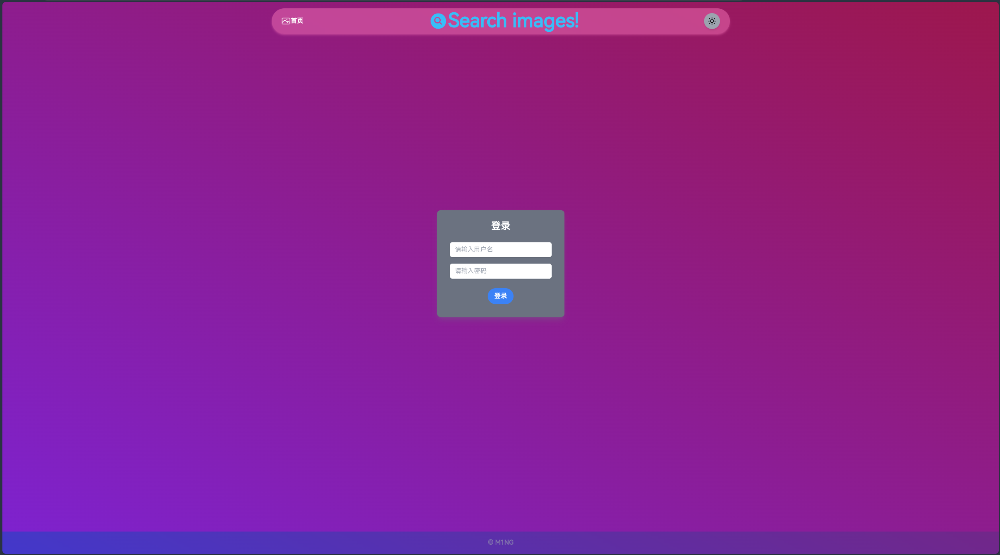
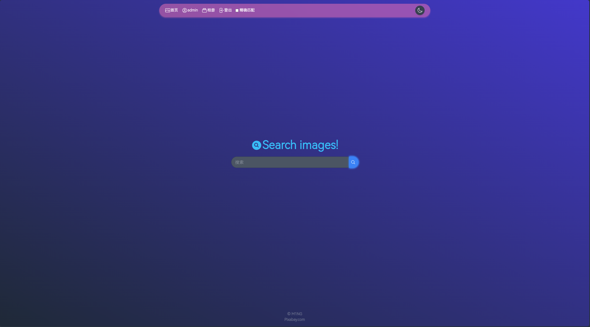
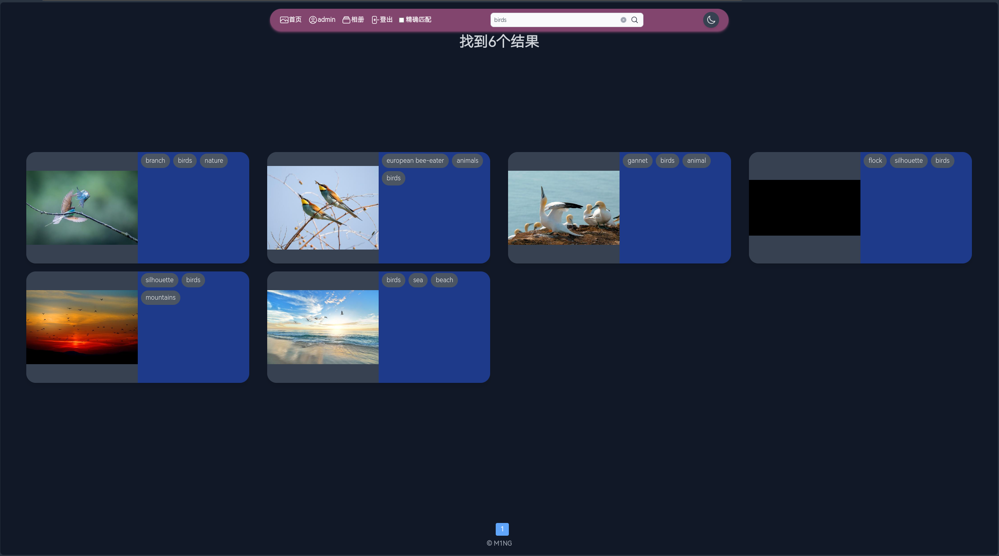
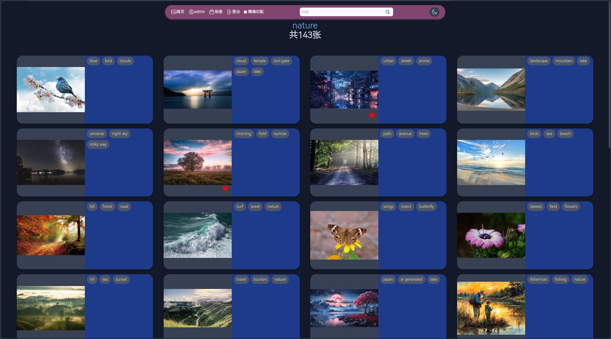
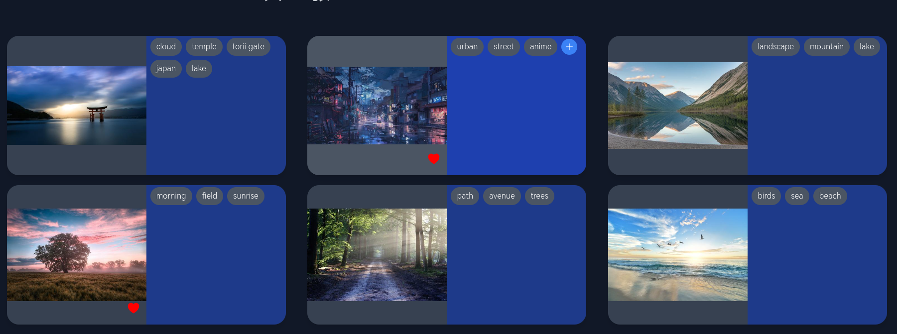

# PicSearcher

PicSearcher is a web-based application built using Flask and TailwindCSS. This project allows users to search for images based on keywords.
Refer to the [Installation](#installation) section for instructions on how to set up the project on your local machine.

## Features

- Search for images using keywords
- Responsive design with TailwindCSS
- Simple and intuitive user interface
- Like and save images to a collection
- View saved images in the gallery

## Pages
Login:

Main page:

Search results:

Gallery:

Into gallery:

Card hovering:


## Technologies Used

- Flask: A lightweight WSGI web application framework in Python
- TailwindCSS: A utility-first CSS framework for rapid UI development
- MySQL: An open-source relational database management system

## Installation

1. Clone the repository:
    ```bash
    git clone https://github.com/yourusername/PicSearcher.git
    cd PicSearcher
    ```
    Also require local mysql server.

2. Configure TailwindCSS, following the instructions in the [TailwindCSS documentation](https://tailwindcss.com/docs/installation)
    ```bash
    npm install
    npm run build
    ```

3. Install the required packages and configure database:
    ```bash
    pip install -r requirements.txt
    mysql -u [username] -p -e "CREATE DATABASE images;"
    mysql -u [username] -p images < images.sql
    ```


4. Run the Flask application:
    ```bash
    flask run
    ```

5. Open your browser and navigate to `http://127.0.0.1:5000`

## Usage

1. Enter a keyword in the search bar.
2. Click the search button to retrieve images related to the keyword.
3. Browse through the search results.


## Contributing

Contributions are welcome! Please fork the repository and create a pull request with your changes.

## License

This project is licensed under the MIT License. See the [LICENSE](LICENSE) file for details.
